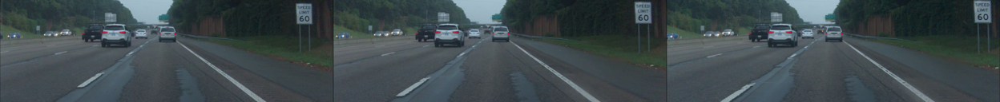
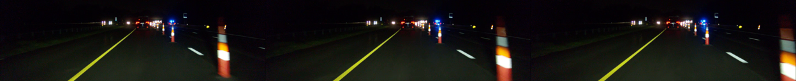

# depth10k

It's ~10,000 PNGs of real driving from comma 3. 3 frames in time order, with 50ms between them. MIT license

It's [comma10k](https://github.com/commaai/comma10k), but for depthnets instead of segnets

A great dataset for training unsupervised depthnets on. We've tried:
* [depth_and_motion_learning](https://github.com/google-research/google-research/tree/master/depth_and_motion_learning)
* [monodepth2](https://github.com/nianticlabs/monodepth2)

and gotten decent results with both. Though they struggle with cars moving a similar speed to you.

We also ran our segnet on them, outputs in segs/. Might be useful for masking motion.

